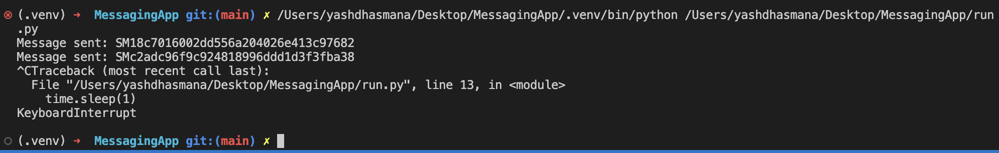
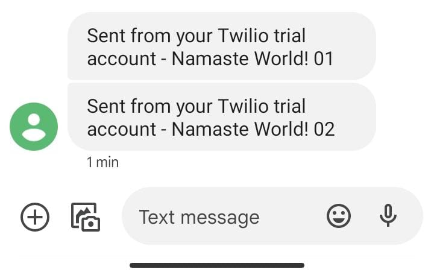
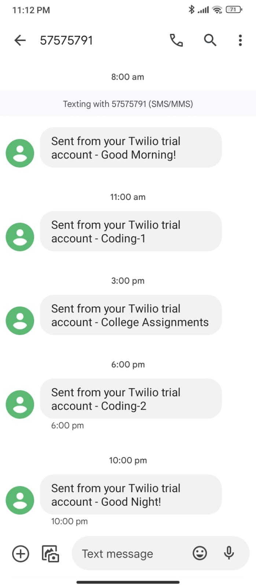

# MessagingApp

using twilio's SMS API to send messages directly to phone as SMS reminder upon a certain calendar event. 

To know more about what i was thinking, why do it in the first place, problems encountered etc. etc. visit [here.](https://github.com/YashDhasmana/NotificationsApp) 

# Testing 

### Initial Test

This was the very initial test of the program where i ran it on my local machine. It worked!

OUTPUT - 

 

 

### Main Test 

Now as the program was working i set it up on a cloud with the request timings being very apart throught the day. 

OUTPUT - 

 
 

# My Learnings 

- using virtual environments 
- managing code in multiple python files 
- using API 
- configuring cloud environments for production apps (kinda)
- Linux systemd files 
- 
-

