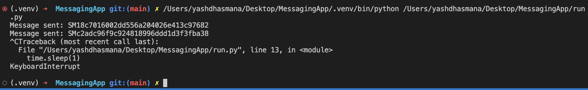
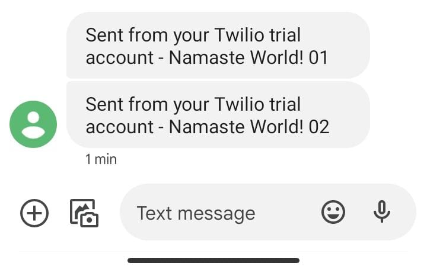

# MessagingApp

using twilio SMS API to send messages directly to phone as SMS reminder upon a certain calendar event. 

### Initial Test

OUTPUT - 

#### cloud setup 

sudo apt-get update 
sudo apt-get -y install python3-pip
dpkg-reconfigure tzdata
pip install twilio 
pip install schedule 
pip install datetime 

transfer files and run 
